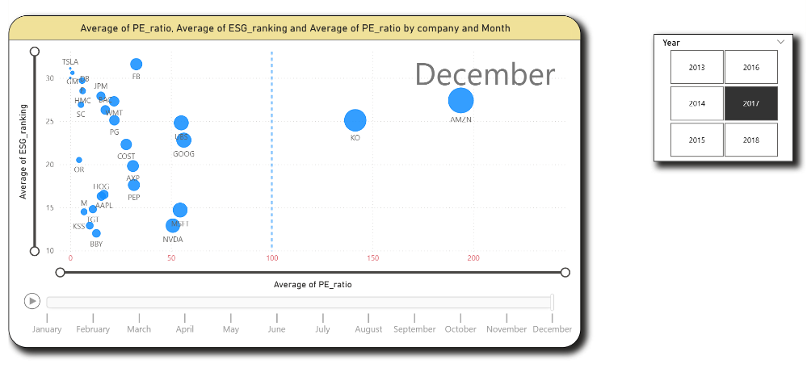
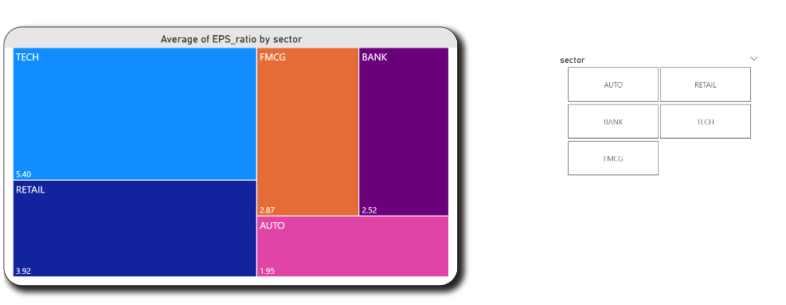
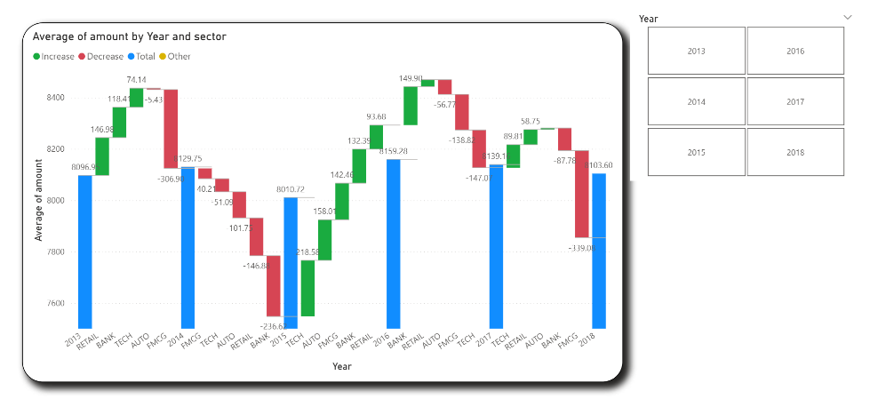

# NYSE Investment Analysis Project

## Project Overview
This project analyzes 400,000 simulated NYSE investments over a 10-year period, focusing on ESG Rankings, Return on Assets (ROA), and volatility. Using Power BI, the analysis delivers actionable insights into investment performance and risk through data transformation, feature creation, and interactive visualizations.

## Tools and Technologies
- **Power BI**: Used for data modeling, transformation, and reporting.
- **Power Query**: Employed for data cleaning, transformation, and feature creation.
- **DAX**: Created custom measures for enhanced analysis and reporting.
- **Files**:
  - `NYSE_Analysis.pbix`: Power BI file with the data model and interactive dashboard.
  - `Visualizations.pdf`: Static export of key visualizations.

## Methodology
1. **Data Simulation**: Generated 400,000 hypothetical NYSE investment records over 10 years.
2. **Key Metrics**:
   - ESG Ranking: Sustainability and ethical performance.
   - ROA: Profitability relative to assets.
   - Volatility: Risk via price fluctuations.
3. **Data Transformation**: Used Power Query to clean data and create new features.
4. **Time Intelligence**: Built a date table and DAX measures for time-based analysis.
5. **Visualization**: Developed interactive Power BI reports for insights.

## Files Included
- `NYSE.pbix`: Main Power BI file with data, transformations, and dashboard.
- `NYSE_Investment.pdf`: PDF of key visualizations from the report.
- `README.md`: This documentation file.

## How to Use
1. **Prerequisites**: Install [Power BI Desktop](https://powerbi.microsoft.com/desktop/).
2. **Open the .pbix File**: Load `NYSE.pbix` in Power BI Desktop.
3. **Explore**: Use filters and slicers to analyze the data interactively.
4. **Review PDF**: See `NYSE_Investment.pdf` for a static summary.

## Dashboard Screenshots
Below are screenshots of the Power BI dashboard showcasing key visualizations and insights from the NYSE Investment Analysis.

1. **ESG Ranking Overview**  
     
   *Description*: Displays the distribution of ESG rankings across investments.

3. **EPS on Sector**  
     
   *Description*: Shows the EPS Ratio over different sectors.

4. **water fall analysis**  
     
   *Description*: Highlights amount patterns.

5. **Interactive Filters and Slicers**  
     
   *Description*: Demonstrates the interactive features for dynamic analysis.
